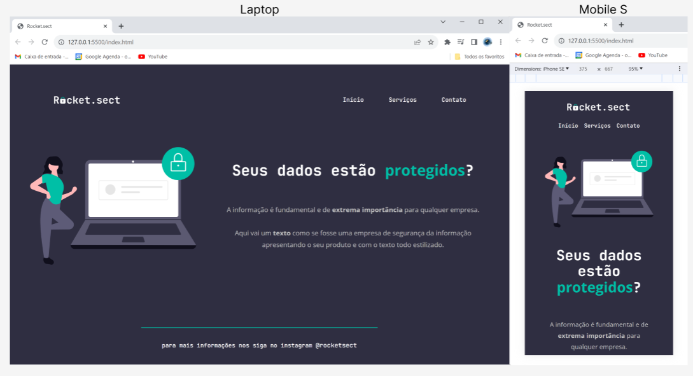

# Rocket.sect - Projeto Desenvolvido

**Este projeto foi desenvolvido como parte de um estudo prático, buscando aprimorar habilidades em programação web. O objetivo é destacar conhecimentos adquiridos e demonstrar uma experiência única ao usuário.**

## Tecnologias Utilizadas

### Linguagens:

- **HTML**: O documento está estruturado em HTML5, garantindo semântica e acessibilidade.
- **CSS**: Estilizado com CSS3 para proporcionar um layout atraente e responsivo.

### Fontes:

- [JetBrains Mono](https://fonts.google.com/specimen/JetBrains+Mono)
- [Open Sans](https://fonts.google.com/specimen/Open+Sans)

### Responsividade:

O site foi desenvolvido com foco na experiência do usuário em diferentes dispositivos. As seguintes técnicas foram aplicadas:

- **Viewport Meta Tag**: Configurada para garantir que o site seja dimensionado corretamente em dispositivos móveis.
- **Media Queries**: Utilizadas para ajustar o layout em diferentes tamanhos de tela, proporcionando uma experiência consistente.

## Estrutura do Código

O código HTML está dividido em seções que representam as principais partes do site:

1. **Head**: Contém metadados e links para as fontes utilizadas.
2. **Body**: Estrutura do conteúdo, incluindo cabeçalho, seção principal e rodapé.
3. **CSS**: O arquivo `style.css` é responsável pela estilização do site, aplicando estilos a elementos específicos.

### Demonstração de Conhecimentos em Programação

Na construção deste projeto, foram utilizadas tags semânticas e práticas recomendadas para garantir uma estrutura HTML clara e acessível. Além disso, o CSS explorou variáveis, seletores e animações para criar uma interface atraente e interativa.

## Responsividade

O design responsivo é crucial para atender a uma variedade de dispositivos. Algumas estratégias adotadas incluem:

- **Unidades Relativas**: Utilização de unidades como porcentagem e `min()` para garantir flexibilidade.
- **Media Queries**: Adaptações específicas para diferentes breakpoints, garantindo uma experiência amigável em dispositivos variados.

## Acessibilidade

Busquei seguir as melhores práticas de acessibilidade, utilizando semântica HTML, descrições alt em imagens e cores de fácil leitura para garantir que o site seja acessível a todos.

**Agradeço por visitar meu repositório!**
